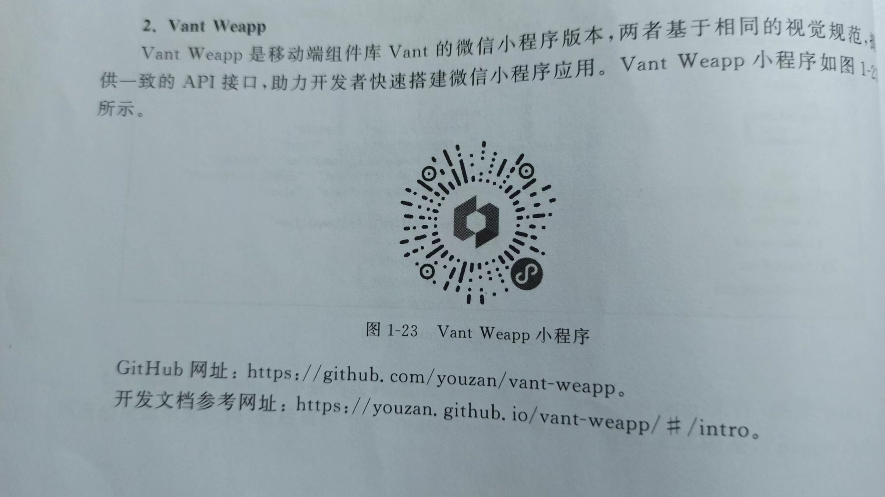

# 1.1 什么是云开发

## 传统开发缺点

## 云开发优点

## 云开发的核心能力

### 云数据库

### 云存储

### 云函数

### 云调用

# 1.2 注册微信小程序

https://mp.weixin.qq.com

# 1.3 新建微信小程序云开发项目

## 开通云开发服务

一般一个账号可以创建2个环境，一个用于测试，一个用于上线。

## 配置云开发环境

## 把云函数上传到云开发中

# 1.4 初始化项目

删除无用的文件

# 1.5 UI组件库及图标库

## 1.5.1 常用UI组件库

### WeUI

### Vant Weapp

### iView Weapp

### ColorUI

### Wux Weapp

### TaroUI

### MinUI

### Lin-UI

## 1.5.2 Vant Weapp组件库

https://youzan.github.io/vant-weapp/#/button

## 1.5.3 iconfont图标库

www.iconfont.cn

## 1.5.4 color-ui组件库

1. 在GitHub中下载，复制demo\colorui文件夹到miniprogram下
2. 在app.wxss引入css文件
   @import "colorui/main.wxss";
   @import "colorui/icon.wxss";
